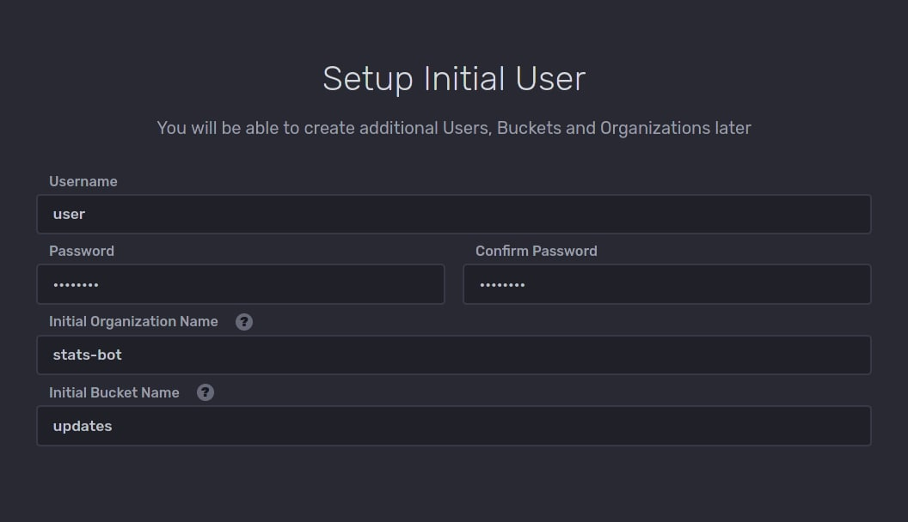
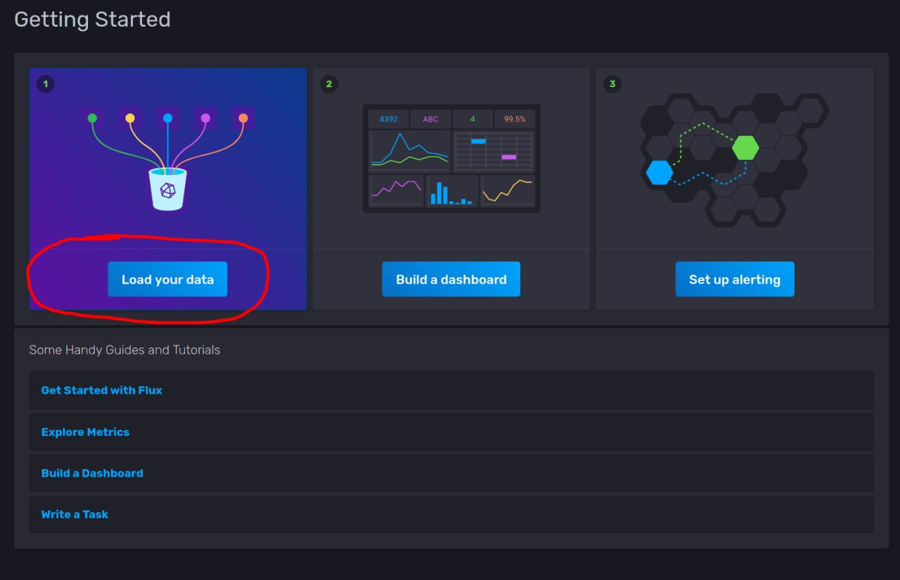
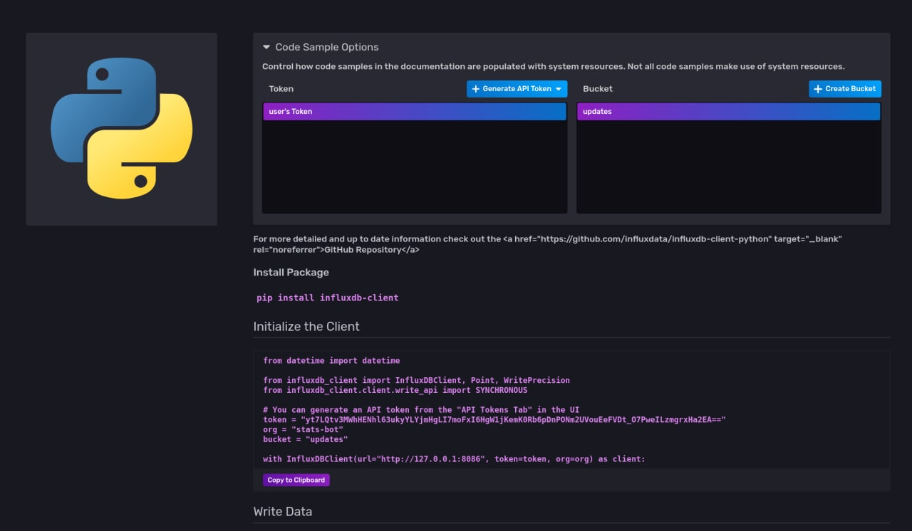

# Первый запуск и настройка InfluxDB

В первый раз следует поднять только контейнер с InfluxDB, для этого в docker-compose файле достаточно закомментировать 
всё, что касается сервиса `bot`. Не забудьте отредактировать путь к каталогу с монтируемыми данными в разделе `volume`! 
Скопируйте файл `env_dist` под названием `.env` и укажите токен будущего бота.

Перейдите по адресу http://127.0.0.1:8086 (если ставите на удалённом сервере, то пробросьте порт без указания локалхоста),
перед вами откроется страница первичной настройки:

Укажите логин (username), пароль, имя "организации" (произвольная строка, её же надо указать в качестве переменной 
`INFLUXDB_ORG` в файле `.env`) и название первой "базы данных". Другие будут созданы позже. 
Договоримся, что в итоге нам нужны два bucket-а, первый под названием "updates" и сроком хранения 
7 дней, второй под названием "events" со сроком хранения 30 дней.

На экране "Getting Started" выберите пункт "Load your data":

Далее найдите логотип Python и нажмите на него:

Отсюда вам нужно извлечь значение токена (и подставить его в свой `.env`-файл), также здесь можно создать новый bucket 
(аналог базы данных). В зависимости от того, какой bucket был создан раньше, создайте новый с нужным сроком хранения. 
А в разделе "Load Data" -> "Buckets" можно отредактировать первоначальный bucket, задав ему свой "срок годности".

По завершению всех манипуляций можно погасить контейнер с InfluxDB и 
раскомментировать секцию `bot` в docker-compose файле.