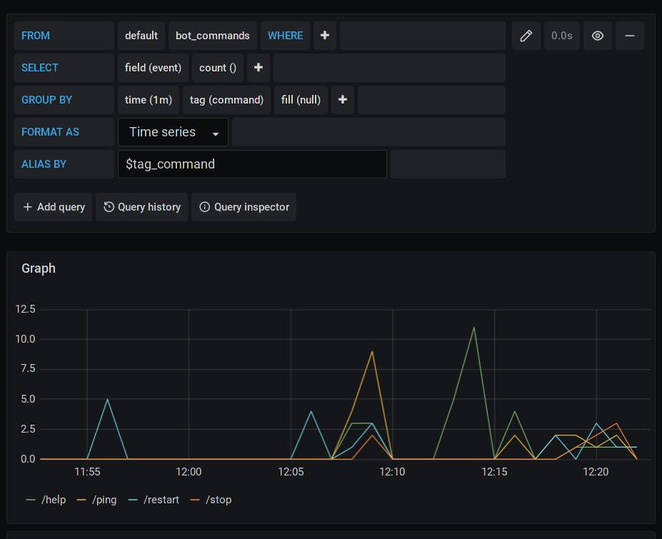

# Сбор статистики в Telegram-ботах

_Disclaimer: далее представлен один из вариантов использования связки aiogram + InfluxDB + Grafana 
для визуализации статистики использования бота. Обо всех замечаниях просьба писать автору лично, 
либо в раздел Issues на GitLab или GitHub_

## Используемые технологии

* [Python](https://docs.python.org/3.8): язык программирования, на котором создан бот
* [Docker](https://www.docker.com/why-docker) и [docker-compose](https://docs.docker.com/compose): 
контейнеризация всех компонентов
* [aiogram](https://github.com/aiogram/aiogram): фреймворк для создания Telegram-ботов
* [InfluxDB](https://www.influxdata.com/products/influxdb): СУБД, оптимизированная для работы с данными, 
содержащими [отметки времени](https://www.influxdata.com/time-series-database)
* [Grafana](https://grafana.com): визуализация данных

## Установка

**Примечание**: подразумевается, что ваша основная ОС основана на ядре Linux. Windows-пользователи могут 
использовать [VirtualBox](https://www.virtualbox.org) для создания виртуальной машины, либо использовать 
[WSL2](https://docs.microsoft.com/ru-ru/windows/wsl/compare-versions), либо что угодно на свой вкус ¯\\\_(ツ)_/¯
 
### Подготовка к запуску Docker-контейнеров

Клонируйте проект (git clone) куда-нибудь, например, в `/home/user/statsbot`. Перейдите в созданный каталог и создайте 
внутри два подкаталога: `mkdir {grafana-data,influxdb}`. Включите отображение скрытых файлов (начинающихся с точки), 
затем скопируйте файл `.env_dist` в `.env`: `cp .env_dist .env`. Заполните указанные переменные своими данными 
(токен укажите свой, а логины, пароли и имя БД придумайте из головы). Наконец, запустите контейнеры командой 
`docker-compose up -d`. Не стесняйтесь читать логи (`docker-compose logs -f`).

### Настройка Grafana

Откройте в браузере страницу `http://127.0.0.1:3000`. В появившемся окне введите логин и пароль по умолчанию (admin/admin),
а на следующем экране нажмите "skip", чтобы пропустить смену пароля до следующей сессии. Нажмите на кнопку "Add data source" 
и выберите строку "InfluxDB". В разделе "HTTP" в качестве URL задайте `http://influxdb:8086` (`influxdb` -- название 
контейнера в файле `docker-compose.yml`). Далее в разделе "InfluxDB Details" укажите имя базы данных, а также логин и 
пароль пользователя (ключи `DB`, `DB_USER` и `DB_PASS` из файла `.env`). Если при нажатии "Save & Test" появилась 
надпись "Data source is working" на зелёном фоне, значит, подключение к БД установлено успешно. 

### Проверка визуализации данных

Перейдите в своего бота и подёргайте различные команды. Вернитесь в Grafana, в левом меню найдите и откройте пункт
"Explore". Установите параметры так, как показано на рисунке ниже. Прочие возможности Grafana предлагается изучить самостоятельно.  
_Некоторые пользователи отмечали, что данные могут отображаться не сразу. Если вы разворачиваете бота поздно вечером, рекомендуется поспать не менее 8 часов и снова проверить отображение данных. Впрочем, дневной сон тоже полезен._

Альтернативный вариант: используйте готовый Dashboard из [соответствующего файла](grafana_dashboard.json).

Удачи!
