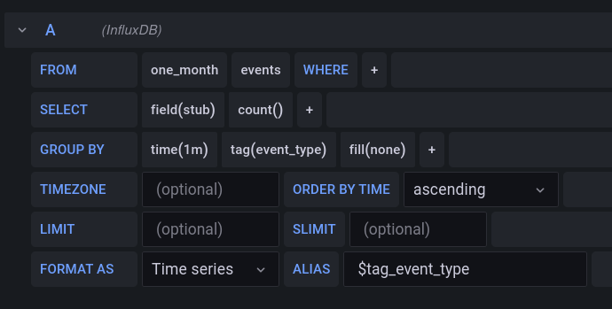
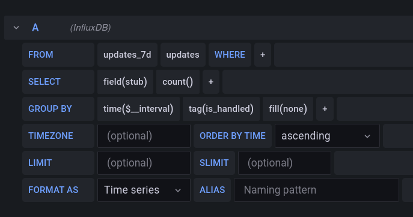

# Сбор статистики в Telegram-ботах

_Disclaimer: далее представлен один из вариантов использования связки aiogram + InfluxDB + Grafana 
для визуализации статистики использования бота. Обо всех замечаниях просьба писать автору лично, 
либо в раздел Issues на GitLab или GitHub_

## Используемые технологии

* [Python 3.9](https://docs.python.org/3.9): язык программирования, на котором создан бот
* [Docker](https://www.docker.com/why-docker) и [docker-compose](https://docs.docker.com/compose): 
контейнеризация всех компонентов
* [aiogram v3](https://github.com/aiogram/aiogram): фреймворк для создания Telegram-ботов
* [InfluxDB v1.8](https://www.influxdata.com/products/influxdb): СУБД, оптимизированная для работы с данными, 
содержащими [отметки времени](https://www.influxdata.com/time-series-database)
* [Grafana v8.2.1](https://grafana.com): визуализация данных

## Установка

**Примечание**: подразумевается, что ваша основная ОС основана на ядре Linux. Windows-пользователи могут 
использовать [VirtualBox](https://www.virtualbox.org) для создания виртуальной машины, либо использовать 
[WSL2](https://docs.microsoft.com/ru-ru/windows/wsl/compare-versions), либо что угодно на свой вкус ¯\\\_(ツ)_/¯
 
## Подготовка к запуску

### Скачивание проекта, создание каталогов и переменных
* Клонируйте проект. 
* Создайте каталоги `influxdb_data` и `grafana_data` где-либо в файловой системе. 
* Переименуйте `docker-compose.example.yml` в `docker-compose.yml`, откройте файл и укажите полные пути к вышесозданным каталогам.
* Переименуйте файл `env_dist` в `.env` и отредактируйте переменные.

### Первоначальная настройка InfluxDB
* Зайдите в `docker-compose.yml` и закомментируйте (символом `#` в начале) все сервисы, кроме `influxdb`
* Выполните `docker-compose up`, в текущей сессии будет запущено приложение в интерактивном режиме
* Откройте ещё одно окно с терминалом и выполните   
`docker exec -it -e INFLUX_USERNAME=admin -e INFLUX_PASSWORD=supersecretadminpassword first-influxdb influx`  
  (здесь `admin` и `supersecretadminpassword` 
взяты из переменных `INFLUXDB_ADMIN_USER` и `INFLUXDB_ADMIN_PASSWORD` вашего `.env`)

* После подключения к InfluxDB последовательно выполните следующие команды 
* для создания двух Retention Policies (суть таблицы):
```
use botdb
create retention policy "one_month" on "botdb" duration 30d replication 1
create retention policy "updates_7d" on "botdb" duration 7d replication 1
exit
```
Первая 30 дней хранит именованные события, другая 7 дней хранит информацию обо всех апдейтах. Можно закрыть этот терминал.

* Остановите в первом терминале InfluxDB сочетанием клавиш `Ctrl+C`. В `docker-compose.yml` 
можно убрать строку `container_name` у сервиса `influxdb`
* Раскомментируйте остальные сервисы

## Запуск сервисов

Запустите все сервисы командой `docker-compose up -d`. При помощи `docker ps` можно убедиться, что они все подняты успешно, 
а команда `docker-compose logs` покажет логи (ключ `-f` позволяет читать логи "в прямом эфире").

## Настройка Grafana

Откройте в браузере страницу `http://127.0.0.1:3000`. В появившемся окне введите логин и пароль по умолчанию (admin/admin),
а на следующем экране нажмите "skip", чтобы пропустить смену пароля до следующей сессии. Нажмите на кнопку "Add data source" 
и выберите строку "InfluxDB". В разделе "HTTP" в качестве URL задайте `http://influxdb:8086` (`influxdb` -- название 
контейнера в файле `docker-compose.yml`). Далее в разделе "InfluxDB Details" укажите имя базы данных, а также логин и 
пароль пользователя (ключи `INFLUXDB_DB`, `INFLUXDB_READ_USER` и `INFLUXDB_READ_USER_PASSWORD` из файла `.env`). Если при нажатии "Save & Test" появилась 
надпись "Data source is working" на зелёном фоне, значит, подключение к БД установлено успешно. 

### Проверка визуализации данных

Перейдите в своего бота и подёргайте команды, `/help` и `/start`, а также отправьте разные текстовые сообщения. 
Вернитесь в Grafana, в левом меню найдите и откройте пункт "Explore". 
Установите параметры так, как показано на рисунке ниже. 
Прочие возможности Grafana предлагается изучить самостоятельно.  

Альтернативный вариант: используйте готовый Dashboard из [соответствующего файла](grafana_dashboard.json).

  


Удачи!
