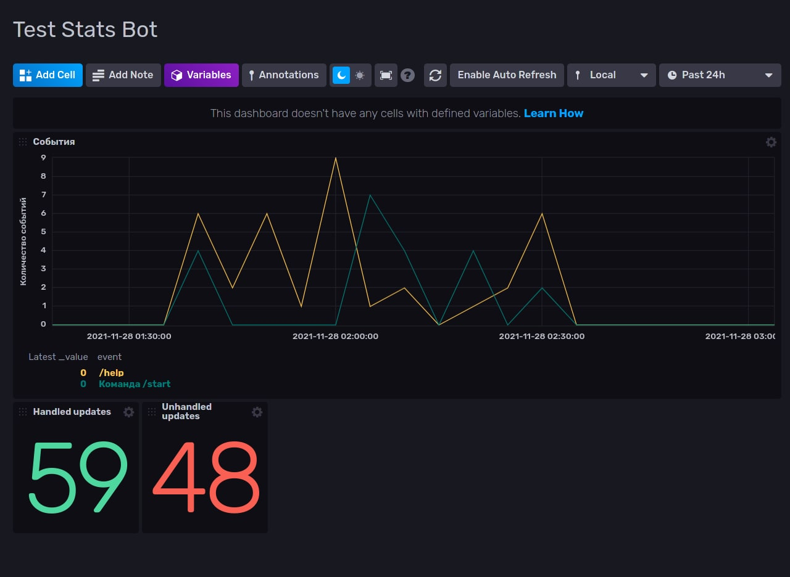

# Сбор статистики в Telegram-ботах

_Disclaimer: далее представлен один из вариантов использования связки aiogram + InfluxDB 
для визуализации статистики использования бота. Обо всех замечаниях просьба писать автору лично, 
либо в раздел Issues на GitLab или GitHub_

## Используемые технологии

* [Python 3.9](https://docs.python.org/3.9): язык программирования, на котором создан бот
* [Docker](https://www.docker.com/why-docker) и [docker-compose](https://docs.docker.com/compose): 
контейнеризация всех компонентов
* [aiogram v3](https://github.com/aiogram/aiogram): фреймворк для создания Telegram-ботов
* [InfluxDB v2.1](https://www.influxdata.com/products/influxdb): СУБД, оптимизированная для работы с данными, 
содержащими [отметки времени](https://www.influxdata.com/time-series-database)

## Установка

**Примечание**: подразумевается, что ваша основная ОС основана на ядре Linux. Windows-пользователи могут 
использовать [VirtualBox](https://www.virtualbox.org) для создания виртуальной машины, либо использовать 
[WSL2](https://docs.microsoft.com/ru-ru/windows/wsl/compare-versions), либо что угодно на свой вкус ¯\\\_(ツ)_/¯
 
## Подготовка к запуску

### Скачивание проекта, создание каталогов и переменных
* Клонируйте проект. 
* Создайте каталог `influxdb_data` где-либо в файловой системе. 
* Переименуйте `docker-compose.example.yml` в `docker-compose.yml`, откройте файл и укажите полные пути к вышесозданным каталогам.
* Переименуйте файл `env_dist` в `.env` и отредактируйте переменные.

### Первоначальная настройка InfluxDB
Описана в [этом фале](FIRSTRUN.md)

## Запуск сервисов

Запустите все сервисы командой `docker-compose up -d`. При помощи `docker ps` можно убедиться, что они все подняты успешно, 
а команда `docker-compose logs` покажет логи (ключ `-f` позволяет читать логи "в прямом эфире").

В файле [dashboard.json](dashboard.json) находится пример дэшборда для просмотра некоторых данных из примера. 
Импортировать его можно в разделе Dashboards в InfluxDB UI -> Create Dashboard -> Import Dashboard.

Удачи!
